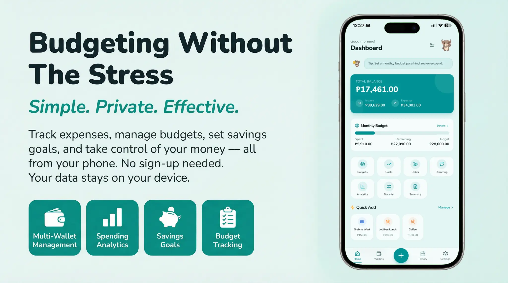
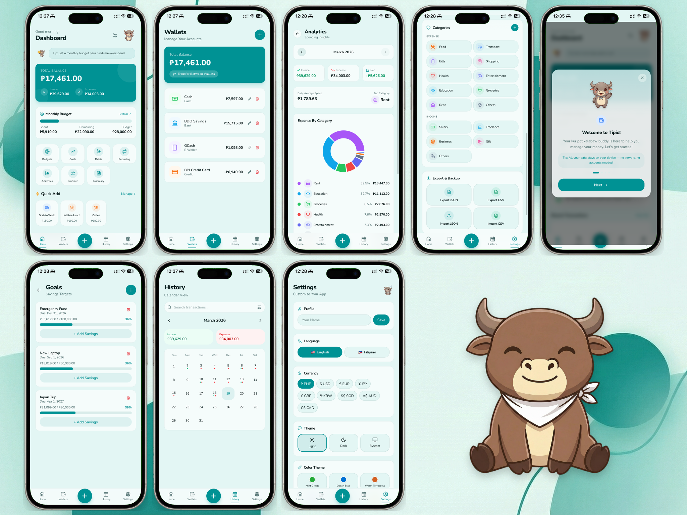

# Tipid — Budgeting Without The Stress



Tipid ("thrifty" in Filipino) is a free, offline-first personal budget tracker Progressive Web App built for Filipino users. Track expenses, manage budgets, set savings goals, and analyze spending patterns — all from your phone, with no sign-up required. Your data never leaves your device.

**Live App:** [tipidbudget.vercel.app](https://tipidbudget.vercel.app)

## App Previews

<div align="center">
  
</div>

## Key Features

| Feature | Description |
|---------|-------------|
| **Smart Dashboard** | Total balance, income/expense overview, budget progress, quick-add templates |
| **Multiple Wallets** | Manage Cash, Bank, E-Wallet (GCash), and Credit Card accounts |
| **Budget Tracking** | Set monthly category limits and track spending against them |
| **Savings Goals** | Set targets with deadlines and track progress |
| **Spending Analytics** | Donut chart breakdown by category, daily averages, top categories |
| **Calendar History** | Calendar view with transaction dots and monthly summaries |
| **Debt Tracking** | Track money you owe and money others owe you |
| **Recurring Transactions** | Auto-create daily, weekly, or monthly transactions |
| **Monthly Summary** | Shareable monthly report card |
| **Bilingual** | English and Filipino (Tagalog) language support |
| **6 Color Themes** | Green, Ocean Blue, Terracotta, Lavender, Teal, Charcoal+Gold |
| **Dark Mode** | Light, Dark, and System theme support |
| **PWA** | Installable as a native-like app, works fully offline |
| **100% Private** | All data stored locally in your browser — nothing sent to any server |

## Tech Stack

| Technology | Version | Purpose |
|-----------|---------|---------|
| **TypeScript** | 5.6.3 | Primary language |
| **React** | 19.2.1 | UI framework |
| **Vite** | 7.1.7 | Build tool and dev server |
| **Tailwind CSS** | 4.1.14 | Utility-first styling |
| **Zustand** | 5.0.12 | State management with localStorage persistence |
| **Wouter** | 3.3.5 | Lightweight client-side routing |
| **Radix UI** | Latest | Accessible UI primitives (shadcn/ui pattern) |
| **Recharts** | 2.15.2 | Charts and data visualization |
| **Framer Motion** | 12.23.22 | Animations and transitions |
| **Workbox** | via vite-plugin-pwa | Offline caching and PWA support |
| **Playwright** | 1.58.2 | End-to-end testing |

## Prerequisites

Before running locally, ensure you have the following installed:

| Requirement | Version | Installation |
|------------|---------|-------------|
| **Node.js** | 22+ | [nodejs.org](https://nodejs.org) or via `nvm` |
| **pnpm** | 10.4.1+ | `npm install -g pnpm` or `corepack enable` |
| **Git** | Any recent | [git-scm.com](https://git-scm.com) |

No database, Redis, or external services are required. The app runs entirely in the browser.

## Getting Started

### 1. Clone the Repository

```bash
git clone https://github.com/mltpascual/BudgetTracker.git
cd BudgetTracker
```

### 2. Install Dependencies

```bash
pnpm install
```

This installs all dependencies including React, Tailwind CSS, Radix UI, Recharts, and build tools.

### 3. Start the Development Server

```bash
pnpm dev
```

The app will be available at [http://localhost:3000](http://localhost:3000). The dev server supports hot module replacement (HMR) for instant feedback during development.

### 4. Open in Browser

Navigate to `http://localhost:3000`. You will see the landing page. Click **"Open App"** to enter the budget tracker. On first visit, the onboarding walkthrough will guide you through the app's features.

### 5. Load Demo Data (Optional)

To see the app with sample data, go to **Settings → Load Demo Data**. This populates the app with mock transactions, wallets, budgets, goals, and debts so you can explore all features immediately.

## Available Scripts

| Command | Description |
|---------|-------------|
| `pnpm dev` | Start Vite dev server with HMR on port 3000 |
| `pnpm build` | Production build to `dist/public/` |
| `pnpm preview` | Preview the production build locally |
| `pnpm check` | TypeScript type checking (`tsc --noEmit`) |
| `pnpm format` | Format all files with Prettier |
| `pnpm start` | Start the Express production server (serves `dist/`) |

## Architecture

### High-Level Overview

Tipid is a **client-side-only SPA** with no backend database or API. The architecture is intentionally simple:

```
User's Browser
├── Tipid React SPA (all business logic)
├── Zustand Store → localStorage ("tipid-storage")
└── Service Worker (Workbox) → Offline caching

External Services (read-only)
├── Vercel CDN → Serves static build
├── AWS CloudFront → Mascot images & PWA icons
└── Google Fonts → Nunito font family
```

### Directory Structure

```
BudgetTracker/
├── client/                          # Frontend application
│   ├── public/                      # Static assets
│   │   └── assets/mockups/          # Phone mockup images for landing page
│   ├── src/
│   │   ├── App.tsx                  # Root component (providers, routing)
│   │   ├── main.tsx                 # React DOM entry point
│   │   ├── index.css                # Design system (6 themes, dark mode, OKLCH)
│   │   ├── const.ts                 # Client-side constants
│   │   ├── components/              # Shared React components
│   │   │   ├── ui/                  # 50+ shadcn/ui primitives (Button, Card, Dialog...)
│   │   │   ├── skeletons/           # Loading skeletons (Dashboard, History)
│   │   │   ├── AppLayout.tsx        # Bottom navigation layout wrapper
│   │   │   ├── CategoryIcon.tsx     # Category → Lucide icon mapper
│   │   │   ├── SwipeableRow.tsx     # Touch-swipeable list row
│   │   │   ├── SpendingInsights.tsx  # AI-style spending analysis widget
│   │   │   └── ...                  # ErrorBoundary, Onboarding, InstallPrompt, etc.
│   │   ├── contexts/
│   │   │   └── ThemeContext.tsx      # Color theme + dark mode provider
│   │   ├── hooks/
│   │   │   ├── useMobile.tsx        # Mobile viewport detection
│   │   │   ├── useNotifications.ts  # Browser notification management
│   │   │   └── ...
│   │   ├── lib/
│   │   │   ├── store.ts             # Zustand store (all data models + actions)
│   │   │   ├── i18n.ts              # English/Filipino translations
│   │   │   ├── mockData.ts          # Demo data generator
│   │   │   └── utils.ts             # cn() utility for Tailwind
│   │   └── pages/
│   │       ├── Landing.tsx          # Marketing landing page
│   │       ├── NotFound.tsx         # 404 page
│   │       └── app/                 # Feature pages
│   │           ├── Dashboard.tsx    # Main overview (804 lines)
│   │           ├── Settings.tsx     # Preferences & data management (991 lines)
│   │           ├── History.tsx      # Calendar + transaction history (574 lines)
│   │           ├── Analytics.tsx    # Spending charts & insights (378 lines)
│   │           ├── Wallets.tsx      # Account management (234 lines)
│   │           ├── Goals.tsx        # Savings goals (247 lines)
│   │           ├── Budgets.tsx      # Monthly budgets (210 lines)
│   │           ├── Debts.tsx        # Debt tracking (288 lines)
│   │           ├── Recurring.tsx    # Recurring transactions (375 lines)
│   │           ├── AddTransaction.tsx  # New transaction form (246 lines)
│   │           ├── TransferPage.tsx # Inter-account transfers (275 lines)
│   │           └── MonthlySummary.tsx  # Monthly report (398 lines)
├── server/
│   └── index.ts                     # Minimal Express server (production fallback)
├── shared/
│   └── const.ts                     # Shared constants
├── e2e/
│   └── tipid.spec.ts               # Playwright E2E tests (337 lines)
├── patches/
│   └── wouter@3.7.1.patch          # Wouter routing patch
├── docs/                            # All project documentation
│   ├── DESIGN.md                    # Design system documentation
│   ├── architecture/                # C4 architecture docs (context, container, component)
│   ├── conductor/                   # Project context (product, tech stack, workflow)
│   └── assets/                      # App mockup images (dashboard, wallets, etc.)
├── package.json                     # Dependencies and scripts
├── vite.config.ts                   # Vite + PWA + chunk splitting config
├── tsconfig.json                    # TypeScript configuration
├── vercel.json                      # Vercel deployment config
└── playwright.config.ts             # E2E test configuration
```

### Data Model

All data is stored in `localStorage` under the key `tipid-storage` as a JSON object managed by Zustand's persist middleware.

| Entity | Key Fields | Description |
|--------|-----------|-------------|
| **Transaction** | amount, type (income/expense), categoryId, accountId, date, note | Individual financial entry |
| **Account** | name, type (cash/bank/ewallet/credit), balance, currency | Financial wallet |
| **Category** | name, icon, color, type | Transaction category (15 defaults) |
| **Budget** | categoryId, limit, period (monthly) | Monthly spending limit |
| **Goal** | name, targetAmount, currentAmount, deadline | Savings target |
| **Debt** | name, totalAmount, paidAmount, type (owe/owed) | Debt tracking |
| **RecurringEntry** | amount, frequency (daily/weekly/monthly), nextDue, active | Auto-recurring template |
| **Transfer** | fromAccountId, toAccountId, amount | Inter-account transfer |
| **QuickTemplate** | name, amount, type, categoryId | One-tap transaction template |
| **UserSettings** | name, currency, theme, hasOnboarded | User preferences |

### Request Lifecycle

Since Tipid is entirely client-side, the "request lifecycle" is a React rendering cycle:

```
User Interaction (tap/click)
    → React Event Handler
    → Zustand Store Action (e.g., addTransaction)
    → State Update + localStorage Persist
    → React Re-render (subscribed components)
    → UI Update
```

### Routing

Client-side routing is handled by Wouter (lightweight alternative to React Router):

| Route | Page | Description |
|-------|------|-------------|
| `/` | Landing | Marketing page with features and CTA |
| `/app` | Dashboard | Main budget overview |
| `/app/add` | AddTransaction | New transaction form |
| `/app/wallets` | Wallets | Account management |
| `/app/history` | History | Calendar + transaction list |
| `/app/settings` | Settings | Preferences and data management |
| `/app/budgets` | Budgets | Monthly budget limits |
| `/app/goals` | Goals | Savings goals |
| `/app/debts` | Debts | Debt tracking |
| `/app/recurring` | Recurring | Recurring transactions |
| `/app/analytics` | Analytics | Spending charts |
| `/app/transfer` | TransferPage | Inter-account transfers |
| `/app/summary` | MonthlySummary | Monthly report |

All `/app/*` routes are wrapped in `AppLayout` which provides the fixed bottom navigation bar.

### Design System

Tipid follows the **"Sawali Weave" — Filipino Craft Minimalism** design philosophy. Key design decisions:

| Aspect | Implementation |
|--------|---------------|
| **Font** | Nunito (unified across all elements) — warm, rounded, friendly |
| **Color Space** | OKLCH for perceptual uniformity across 6 themes |
| **Card Style** | Frosted glass (85% opacity white) for layered depth |
| **Shadows** | None — depth from translucency, not shadows |
| **Border Radius** | 16px (`1rem`) — generously rounded "bubble" cards |
| **Mascot** | Carabao (water buffalo) — cozy companion, not corporate mascot |
| **Layout** | Single-column mobile-first, max-width 1280px on desktop |

For the complete design system, see [DESIGN.md](./docs/DESIGN.md).

## Environment Variables

Tipid requires **no environment variables** for local development. The app runs entirely in the browser with no API keys, database connections, or server-side secrets.

For the Vercel deployment, the following are configured automatically:

| Variable | Description | Required |
|----------|-------------|----------|
| `NODE_ENV` | Set to `production` by Vercel | Auto |
| `VITE_OAUTH_PORTAL_URL` | OAuth portal URL (if using Manus auth) | Optional |
| `VITE_APP_ID` | App ID for OAuth integration | Optional |

## Testing

### End-to-End Tests (Playwright)

The E2E test suite covers core user flows on an iPhone 15 Pro Max viewport (430x932):

```bash
# Install Playwright browsers (first time only)
npx playwright install chromium

# Run E2E tests
npx playwright test

# Run with UI mode for debugging
npx playwright test --ui

# Run a specific test
npx playwright test -g "should add a transaction"
```

Test coverage includes: onboarding flow, adding transactions, wallet management, budget creation, goal tracking, debt management, recurring transactions, transfers, analytics viewing, history navigation, settings changes, data export/import, and demo data loading.

### Type Checking

```bash
pnpm check
```

Runs `tsc --noEmit` to verify TypeScript types without producing output files.

### Code Formatting

```bash
pnpm format
```

Formats all files using Prettier with the project's configuration.

## Deployment

### Vercel (Primary — Recommended)

Tipid is deployed as a static site on Vercel with automatic deployments from the `main` branch.

**Setup:**

1. Fork or push the repository to GitHub.
2. Import the project in [Vercel Dashboard](https://vercel.com/new).
3. Vercel auto-detects Vite and configures the build.
4. No environment variables are required.

**Configuration** (already in `vercel.json`):

```json
{
  "buildCommand": "vite build",
  "outputDirectory": "dist/public",
  "framework": "vite",
  "rewrites": [
    { "source": "/(.*)", "destination": "/index.html" }
  ]
}
```

Every push to `main` triggers an automatic build and deployment.

### Self-Hosted (Docker or Static Server)

Since Tipid is a static SPA, you can host it on any static file server:

```bash
# Build the production bundle
pnpm build

# The output is in dist/public/
# Serve with any static server:
npx serve dist/public

# Or use the included Express server:
pnpm start
```

For Docker deployment, create a simple Dockerfile:

```dockerfile
FROM node:22-alpine AS builder
WORKDIR /app
COPY package.json pnpm-lock.yaml ./
RUN corepack enable && pnpm install --frozen-lockfile
COPY . .
RUN pnpm build

FROM nginx:alpine
COPY --from=builder /app/dist/public /usr/share/nginx/html
COPY nginx.conf /etc/nginx/conf.d/default.conf
EXPOSE 80
```

With an `nginx.conf` that handles SPA routing:

```nginx
server {
    listen 80;
    root /usr/share/nginx/html;
    index index.html;

    location / {
        try_files $uri $uri/ /index.html;
    }
}
```

### Build Optimization

The Vite build includes manual chunk splitting for optimal loading:

| Chunk | Contents | Purpose |
|-------|----------|---------|
| `vendor-react` | React, React DOM | Core framework (cached long-term) |
| `vendor-charts` | Recharts | Chart library (loaded only when needed) |
| `vendor-motion` | Framer Motion | Animation library |
| `vendor-ui` | All Radix UI components | UI primitives |

## Offline Support (PWA)

Tipid is a fully installable Progressive Web App. The Service Worker (generated by Workbox via vite-plugin-pwa) implements the following caching strategies:

| Strategy | Target | Cache Duration |
|----------|--------|---------------|
| **Precache** | All build assets (JS, CSS, HTML) | Until next build |
| **CacheFirst** | CloudFront CDN images (mascot) | 30 days |
| **CacheFirst** | Google Fonts webfonts | 1 year |
| **StaleWhileRevalidate** | Google Fonts stylesheets | Always fresh |

After the first visit, the app works 100% offline. Users can install it to their home screen for a native-like experience.

## Internationalization (i18n)

Tipid supports two languages, toggled in Settings:

| Language | Code | Coverage |
|----------|------|----------|
| English | `en` | Full |
| Filipino (Tagalog) | `fil` | Full |

Translations are defined in `client/src/lib/i18n.ts`. The `useLanguage()` hook provides the current language's translation object to all components.

## Contributing

1. Fork the repository.
2. Create a feature branch: `git checkout -b feature/my-feature`.
3. Make your changes and ensure `pnpm check` passes.
4. Format your code: `pnpm format`.
5. Run E2E tests: `npx playwright test`.
6. Commit and push your branch.
7. Open a Pull Request against `main`.

## Related Documentation

| Document | Description |
|----------|-------------|
| [DESIGN.md](./docs/DESIGN.md) | Complete design system (colors, typography, components, themes) |
| [conductor/](./docs/conductor/) | Project context for AI agent handoff (product, tech stack, workflow) |
| [architecture/](./docs/architecture/) | C4 architecture documentation (context, container, component levels) |

## License

This project is licensed under the **MIT License**. See the `package.json` for details.

---

*Made with care for Pinoy budgeters.*
