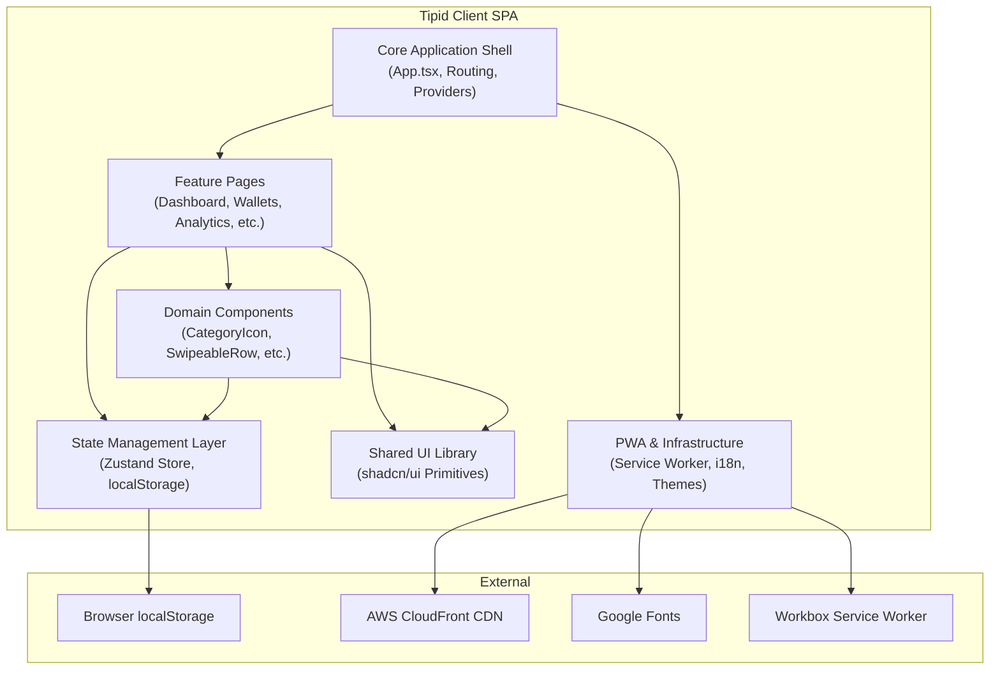

# C4 Component Index: Tipid Budget Tracker

## Component Overview

The Tipid Client SPA is organized into 6 logical components. Since the application is entirely client-side, all components exist within a single deployment container (the browser).

## System Components

| Component | Description | Documentation |
|-----------|-------------|---------------|
| **Core Application Shell** | App entry point, routing (Wouter), error boundaries, theme/tooltip providers, lazy loading orchestration | [c4-component-app-shell.md](./c4-component-app-shell.md) |
| **State Management Layer** | Zustand store with all data models (Transaction, Account, Budget, Goal, Debt, RecurringEntry, Transfer, QuickTemplate), CRUD actions, and localStorage persistence | [c4-component-state-management.md](./c4-component-state-management.md) |
| **Feature Pages** | 12 route-level page components: Dashboard, AddTransaction, Wallets, History, Settings, Budgets, Goals, Debts, Recurring, Analytics, TransferPage, MonthlySummary, plus Landing and NotFound | [c4-component-feature-pages.md](./c4-component-feature-pages.md) |
| **Shared UI Library** | 50+ Radix-based UI primitives following the shadcn/ui pattern: Button, Card, Dialog, Select, Tabs, Calendar, Chart, etc. | [c4-component-ui-library.md](./c4-component-ui-library.md) |
| **Domain Components** | Business-specific shared components: CategoryIcon, AccountTypeIcon, SwipeableRow, SpendingInsights, EditTransactionDialog, Onboarding, AppLayout | [c4-component-domain-components.md](./c4-component-domain-components.md) |
| **PWA and Infrastructure** | Service Worker (Workbox), InstallPrompt, OfflineIndicator, i18n system, ThemeContext, custom hooks | [c4-component-pwa.md](./c4-component-pwa.md) |

## Component Relationships Diagram

## Data Flow

The application follows a **unidirectional data flow** pattern:

1. **User Interaction** occurs on Feature Pages or Domain Components.
2. **Actions** are dispatched to the Zustand Store (e.g., `addTransaction`, `updateGoal`).
3. **State Updates** are automatically persisted to `localStorage` via Zustand's persist middleware.
4. **UI Re-renders** occur as React components subscribe to store slices via `useTipidStore` selectors.
5. **Derived Data** (formatted currency, budget percentages, analytics) is computed in components from raw store data.

## Technology Summary

| Layer | Technologies |
|-------|-------------|
| **Framework** | React 19 with lazy loading and Suspense |
| **Routing** | Wouter 3.3.5 (lightweight, patched) |
| **State** | Zustand 5.0.12 with persist middleware |
| **Styling** | Tailwind CSS 4 with OKLCH custom properties |
| **UI Primitives** | Radix UI (shadcn/ui pattern) with class-variance-authority |
| **Charts** | Recharts 2.15.2 |
| **Animation** | Framer Motion 12.23.22 |
| **Icons** | Lucide React 0.453.0 |
| **Forms** | React Hook Form 7.64.0 + Zod 4.1.12 |
| **Dates** | date-fns 4.1.0 |
| **PWA** | vite-plugin-pwa with Workbox |
| **Build** | Vite 7.1.7 with manual chunk splitting |
