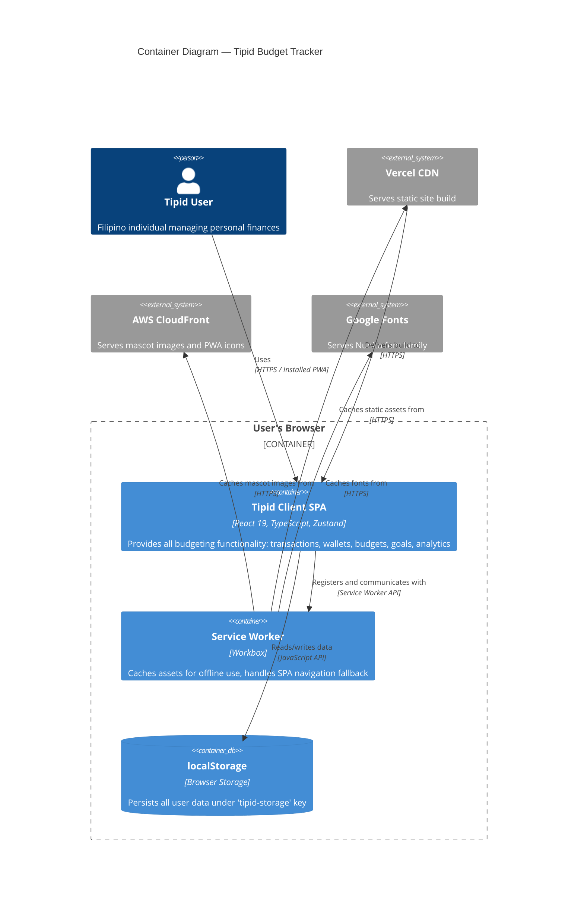

# C4 Container: Tipid Budget Tracker

## Container Overview

Tipid is architecturally simple — it is a **single-container application** deployed as a static site. There is no backend API, no database server, and no microservices. The entire application runs in the user's browser.

## Containers

### 1. Tipid Client SPA

| Property | Value |
|----------|-------|
| **Name** | Tipid Client SPA |
| **Description** | Single-page React application that provides all budgeting functionality |
| **Type** | Web Application (Static SPA) |
| **Technology** | React 19, TypeScript, Vite 7, Tailwind CSS 4, Zustand, Wouter |
| **Deployment** | Static files served from Vercel CDN |

**Purpose:** The Tipid Client SPA is the entire application. It handles all user interactions, data processing, state management, and rendering. All business logic (transaction calculations, budget tracking, goal progress, recurring transaction processing) runs client-side in JavaScript. Data is persisted to `localStorage` via Zustand's persist middleware.

**Components Deployed in This Container:**

| Component | Description | Documentation |
|-----------|-------------|---------------|
| Core Application Shell | App entry, routing, error boundaries, theme provider | [c4-component-app-shell.md](./c4-component-app-shell.md) |
| State Management Layer | Zustand store with all data models and actions | [c4-component-state-management.md](./c4-component-state-management.md) |
| Feature Pages | Dashboard, Wallets, Analytics, Goals, History, etc. | [c4-component-feature-pages.md](./c4-component-feature-pages.md) |
| Shared UI Components | Buttons, cards, dialogs, forms (shadcn/ui pattern) | [c4-component-ui-library.md](./c4-component-ui-library.md) |
| Domain Components | CategoryIcon, AccountTypeIcon, SwipeableRow, SpendingInsights | [c4-component-domain-components.md](./c4-component-domain-components.md) |
| PWA Layer | Service Worker, install prompt, offline indicator | [c4-component-pwa.md](./c4-component-pwa.md) |

### 2. Express Static Server (Production Only)

| Property | Value |
|----------|-------|
| **Name** | Express Static Server |
| **Description** | Minimal Express server that serves the built static files |
| **Type** | Web Server |
| **Technology** | Express.js, Node.js |
| **Deployment** | Not used in Vercel deployment (Vercel handles static serving natively) |

**Purpose:** The Express server in `server/index.ts` exists as a fallback for non-Vercel deployments. It serves the `dist/public` directory and handles SPA routing by returning `index.html` for all routes. In the primary Vercel deployment, this server is not used — Vercel's built-in static hosting and `vercel.json` rewrites handle everything.

### 3. Service Worker (Workbox)

| Property | Value |
|----------|-------|
| **Name** | Workbox Service Worker |
| **Description** | Auto-generated Service Worker for offline caching and PWA support |
| **Type** | Browser Worker |
| **Technology** | Workbox (via vite-plugin-pwa) |
| **Deployment** | Generated at build time, registered by the browser |

**Purpose:** The Service Worker provides offline functionality by precaching all build assets (JS, CSS, HTML, images, fonts) and implementing runtime caching strategies for CDN images (CacheFirst, 30-day expiry) and Google Fonts (StaleWhileRevalidate for stylesheets, CacheFirst for webfonts with 1-year expiry). It also handles SPA navigation fallback to `index.html`.

## Interfaces

Since Tipid is a client-side-only application, there are no traditional API interfaces between containers. The primary interfaces are:

| Interface | Protocol | Description |
|-----------|----------|-------------|
| **localStorage API** | JavaScript | Read/write all application data via `tipid-storage` key |
| **Service Worker Registration** | Browser API | Register and manage the Workbox-generated Service Worker |
| **CDN Asset Loading** | HTTPS | Load mascot images from CloudFront and fonts from Google Fonts |

## Dependencies

| From | To | Protocol | Purpose |
|------|----|----------|---------|
| Tipid Client SPA | Browser localStorage | JS API | Persist all user data |
| Tipid Client SPA | Workbox Service Worker | Browser API | Offline caching |
| Tipid Client SPA | AWS CloudFront | HTTPS | Mascot images, PWA icons |
| Tipid Client SPA | Google Fonts | HTTPS | Nunito font family |
| Workbox Service Worker | CloudFront | HTTPS (cached) | Cache CDN images for offline |
| Workbox Service Worker | Google Fonts | HTTPS (cached) | Cache fonts for offline |

## Infrastructure

| Aspect | Details |
|--------|---------|
| **Build Tool** | Vite 7 with manual chunk splitting |
| **Build Output** | `dist/public/` containing HTML, JS bundles, CSS, and Service Worker |
| **Hosting** | Vercel (free tier, auto-deploy from GitHub) |
| **CDN** | Vercel Edge Network for static assets; CloudFront for mascot images |
| **Domain** | tipidbudget.vercel.app |
| **SSL** | Automatic via Vercel |
| **Scaling** | Automatic via Vercel CDN (static site, no server scaling needed) |

## Container Diagram

