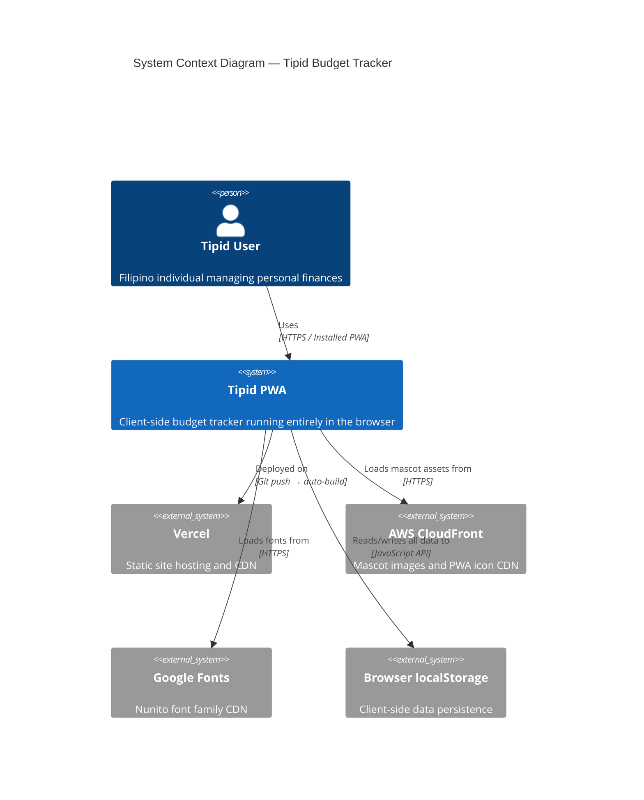

# C4 Context: Tipid Budget Tracker

## System Overview

**Short Description:** Tipid is a free, offline-first personal budget tracker Progressive Web App designed for Filipino users.

**Long Description:** Tipid ("thrifty" in Filipino) is a client-side-only Progressive Web App that enables users to track expenses, manage budgets, set savings goals, and analyze spending patterns. The system stores all data locally in the browser's `localStorage`, requiring no sign-up, no server-side database, and no internet connection after the initial page load. It supports bilingual operation (English and Filipino), 6 color themes, dark mode, and can be installed as a native-like app on mobile devices. The app is deployed as a static site on Vercel and serves mascot assets from AWS CloudFront CDN.

## Personas

### Human Users

| Persona | Type | Description | Goals | Key Features Used |
|---------|------|-------------|-------|-------------------|
| **Young Filipino Professional** | Human User | First-time budgeter using GCash and bank apps, wants a simple mobile tracker | Track daily expenses, stay within monthly budgets, save for goals | Dashboard, Add Transaction, Budgets, Goals |
| **Student** | Human User | Limited income, needs to track allowance and expenses | Monitor spending, avoid overspending, track debts with friends | Dashboard, History, Debts, Analytics |
| **Freelancer** | Human User | Irregular income, manages multiple accounts | Track income across wallets, transfer between accounts, analyze cash flow | Wallets, Transfers, Analytics, Recurring |
| **Privacy-Conscious User** | Human User | Wants budgeting without sharing data with servers | All features, with confidence that data never leaves the device | All features (offline-first architecture) |

### Programmatic Users

| Persona | Type | Description | Integration |
|---------|------|-------------|-------------|
| **Vercel CDN** | External System | Serves the static site build | Auto-deploy on push to `main` branch |
| **CloudFront CDN** | External System | Serves mascot images and PWA icons | Static asset delivery via HTTPS |
| **Service Worker (Workbox)** | Internal System | Caches assets for offline use | Precaches build assets, runtime caches CDN images and Google Fonts |

## System Features

| Feature | Description | Personas | Journey Link |
|---------|-------------|----------|-------------|
| **Transaction Tracking** | Add, view, and categorize income and expense transactions | All users | [Transaction Journey](#transaction-tracking-journey) |
| **Multi-Wallet Management** | Manage Cash, Bank, E-Wallet, and Credit Card accounts with transfers | Freelancer, Professional | [Wallet Journey](#wallet-management-journey) |
| **Budget Management** | Set and monitor monthly category-based spending limits | All users | [Budget Journey](#budget-management-journey) |
| **Savings Goals** | Set target amounts with deadlines and track progress | Professional, Student | [Goals Journey](#savings-goals-journey) |
| **Spending Analytics** | Donut chart breakdown, daily averages, top categories | All users | [Analytics Journey](#analytics-journey) |
| **Calendar History** | Calendar view with transaction dots and monthly summaries | All users | [History Journey](#history-journey) |
| **Debt Tracking** | Track money owed and money others owe you | Student, Freelancer | [Debt Journey](#debt-tracking-journey) |
| **Recurring Transactions** | Auto-create daily/weekly/monthly transactions | Freelancer, Professional | [Recurring Journey](#recurring-journey) |
| **Data Backup/Restore** | Export and import all data as JSON | Privacy-Conscious User | [Backup Journey](#backup-journey) |
| **PWA Installation** | Install as a native-like app on mobile | All users | [Install Journey](#install-journey) |

## User Journeys

### Transaction Tracking Journey

1. **Open App**: User opens Tipid from home screen or browser.
2. **View Dashboard**: Dashboard shows total balance, recent transactions, and budget progress.
3. **Tap "+" Button**: Center FAB button opens the Add Transaction page.
4. **Select Type**: Choose between Income or Expense.
5. **Enter Amount**: Type the amount using the on-screen numpad.
6. **Select Category**: Pick from predefined categories (Food, Transport, Bills, etc.).
7. **Select Account**: Choose which wallet (Cash, Bank, GCash) to debit/credit.
8. **Add Note** (optional): Type a description for the transaction.
9. **Save**: Transaction is saved to localStorage, balances update instantly.
10. **View on Dashboard**: Transaction appears in recent list, charts update.

### Wallet Management Journey

1. **Navigate to Wallets**: Tap "Wallets" in the bottom navigation.
2. **View All Accounts**: See Cash, Bank, E-Wallet, and Credit Card balances.
3. **Transfer Funds**: Tap transfer icon, select source and destination accounts, enter amount.
4. **Confirm Transfer**: Balances update instantly across both accounts.

### Budget Management Journey

1. **Navigate to Budgets**: Access from Dashboard or Settings.
2. **Set Budget**: Choose a category and set a monthly spending limit.
3. **Track Progress**: Dashboard shows budget progress bars with percentage used.
4. **Receive Feedback**: Visual indicators show when approaching or exceeding limits.

### Savings Goals Journey

1. **Navigate to Goals**: Tap "Goals" in the navigation.
2. **Create Goal**: Enter goal name, target amount, and deadline.
3. **Add Savings**: Manually add amounts toward the goal.
4. **Track Progress**: Progress bar shows percentage completed and remaining amount.

### Analytics Journey

1. **Navigate to Analytics**: Tap "Analytics" in the navigation.
2. **View Donut Chart**: See spending breakdown by category.
3. **Review Metrics**: View daily average spend, top spending category, and total.
4. **Filter by Period**: Analyze different time periods.

### History Journey

1. **Navigate to History**: Tap "History" in the bottom navigation.
2. **View Calendar**: Calendar shows dots on days with transactions.
3. **Tap a Date**: See all transactions for that specific day.
4. **View Monthly Summary**: See total income and expenses for the month.

### Debt Tracking Journey

1. **Navigate to Debts**: Access from the navigation menu.
2. **Add Debt**: Enter person's name, amount, due date, and type (I owe / They owe me).
3. **Track Payments**: Update paid amounts as payments are made.
4. **Mark Complete**: Debt disappears when fully paid.

### Recurring Journey

1. **Navigate to Recurring**: Access from the navigation menu.
2. **Create Entry**: Set amount, category, frequency (daily/weekly/monthly), and start date.
3. **Auto-Processing**: On app open, `processRecurring()` creates transactions for all due dates.
4. **Manage**: Toggle active/inactive or delete recurring entries.

### Backup Journey

1. **Navigate to Settings**: Tap "Settings" in the bottom navigation.
2. **Export Data**: Tap "Export Data" to download a JSON file with all app data.
3. **Import Data**: Tap "Import Data" and select a previously exported JSON file.
4. **Verify**: All transactions, accounts, budgets, and settings are restored.

### Install Journey

1. **Visit Website**: Open tipidbudget.vercel.app in a mobile browser.
2. **See Install Prompt**: App shows a custom install prompt after initial use.
3. **Install**: Tap "Install" to add to home screen.
4. **Use Offline**: App works fully offline via Service Worker caching.

## External Systems and Dependencies

| System | Type | Description | Integration | Purpose |
|--------|------|-------------|-------------|---------|
| **Vercel** | Hosting Platform | Static site hosting with auto-deploy | Git push to `main` triggers build and deploy | Serves the compiled React SPA to users |
| **AWS CloudFront** | CDN | Content delivery network for static assets | HTTPS image URLs embedded in source code | Delivers mascot images and PWA icons globally |
| **Google Fonts** | Font CDN | Hosts the Nunito font family | CSS `@import` with Service Worker caching | Provides the app's typography |
| **Browser localStorage** | Local Storage | Client-side key-value storage | Zustand persist middleware writes to `tipid-storage` key | Persists all user data locally on the device |
| **Service Worker (Workbox)** | Browser API | Offline caching and PWA support | vite-plugin-pwa generates SW at build time | Enables offline functionality and app installation |

## System Context Diagram

## Related Documentation

| Document | Path | Description |
|----------|------|-------------|
| Container Documentation | [c4-container.md](./c4-container.md) | Deployment containers and their relationships |
| Component Documentation | [c4-component.md](./c4-component.md) | Logical components and their interfaces |
| Code-Level Documentation | `c4-code-*.md` files | Detailed code analysis per directory |
